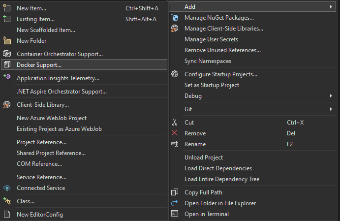
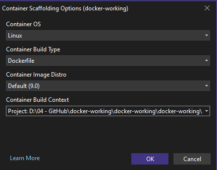
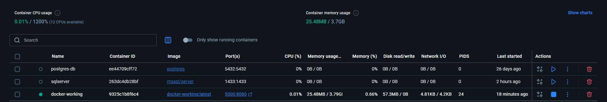
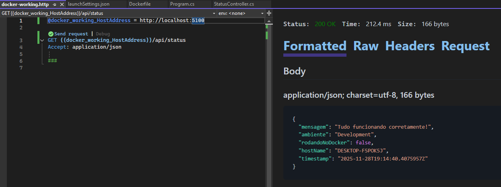
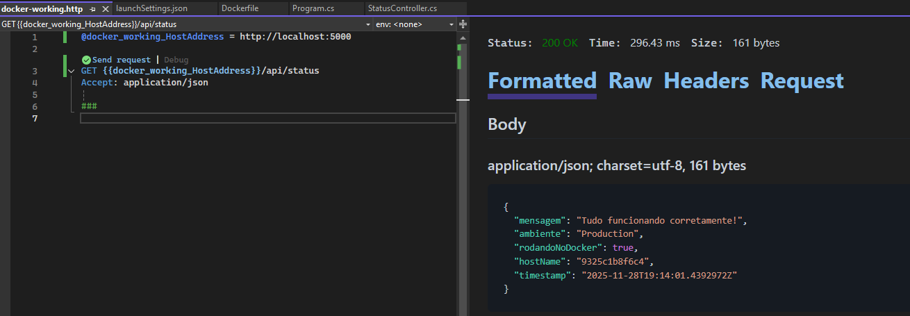
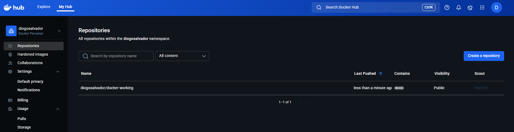

# Container Docker

Este repositório descreve o passo a passo para containerizar uma API ASP.NET Core usando Docker.

---

Criar uma ASP.NET Core Web API
Etapa de Additional Information deixar desmarcado Enable container support, posteriormente será adicionado o arquivo Dockerfile.

Com API criada adicionar o arquivo Dockerfile no projeto. 
<p align="center">
  
</p>

---

Em Docker Build Context selecionar a pasta com contexto do projeto
<p align="center">
  
</p>

---

**Arquivo Dockerfile** deve ter referência a pasta do projeto.
   
   ```bash
COPY ["docker-working.csproj", "."]
RUN dotnet restore "./docker-working.csproj"
   ```

---

**Abrir terminal de comando developer, no Visual Studio**
   
   ```bash
tools > command line > developer command
   ```

---

**Abrir terminal de comando developer, no Visual Studio**

**Navegar até a pasta do projeto**

   ```bash
/docker-working    
   ```

---


**Comando para fazer o build do Projeto e criar a imagen no docker**
   
   ```bash
    docker build -t docker-working:latest .
   ```

---

**Comando para gerar o container, mapeando a porta 8080 para 5000 da aplicação, nome do container e imagem docker**
   
   ```bash
    docker run -d -p 5000:8000 --name docker-working docker-working:latest
   ```

---

**Container deve executar dessa forma.**

<p align="center">
  
</p>

---

**Com aplicação Web API rodando fazer uma chamada no endpoint que retorna informações de onde está executando**

## Request para ambiente local

<p align="center">
  
</p>

---

## Request para ambiente local Docker

<p align="center">
  
</p>

---

**Publicar Imagem Docker no DockerHub**
   ```bash
  docker tag docker-working diogosalvador/docker-working:latest

  docker push diogosalvador/docker-working:latest
   ```

<p align="center">
  
</p>
